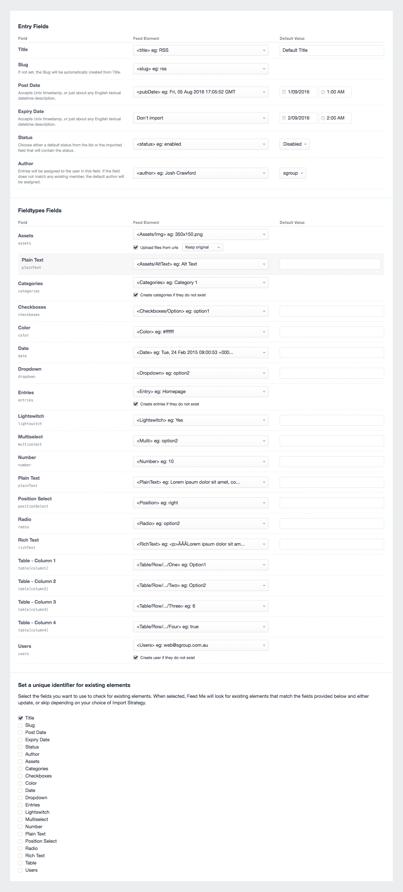

# Field Mapping

Field Mapping provides an interface to match items in your feed to fields in Craft. Depending on the element you’ve selected to import into will determine what fields you have available to map against.

### Element IDs

You can map data in your feed to the Element ID, which is useful if you know for certain an element you want to update. This can be when updating for content in other locales, or bulk-updating existing items.

::: danger
Do not use this when importing new data. If you’re importing your content from another system (ExpressionEngine, WordPress, etc.), your new content will almost assuredly not have the same ID between systems. This is how Craft’s Elements work, and if you specify the wrong Element ID to update, you could be updating the wrong content altogether (an Asset when you meant to update an Entry).
:::

### Unique Identifiers

It's important to select a Unique Identifier for your feed to assist with the Import Strategy you’ve chosen. When comparing against existing entries, it will compare the fields you select here with the data in your feed. Most commonly, this would be the Title for the element, but is also a good idea to be against a unique ID.

::: danger
Updating content based on a Unique Identifier will not work for content stored in Matrix and other nested, Matrix-like fields such as Super Table and Neo.
:::

### Default Value

You can set a default value for any field, and depending on the field, this may be in the form of a text field or a select field. You can also provide a default value using shorthand Twig (if you enable `parseTwig` in your [Configuration](../get-started/configuration.md)), referring to other fields in the element you're importing.

::: tip
Make sure you select `Use default value` in the “Feed Element” dropdown, otherwise it won’t work!
:::

The screenshot above shows three columns. The first is for your Craft field, the second is a dropdown for selecting the node in your feed, and the third is for setting the default value.

You’ll notice the `Assets` field has a Plain Text row in slight grey below it. This represents a field on the element itself.
