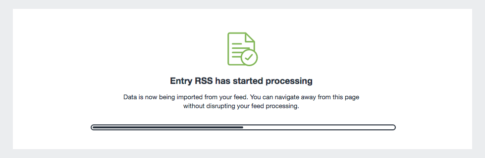

# Importing your Content

Once you've completed mapping your feed’s fields, you can start your first import.
You'll see an overview screen with a loading bar showing the progress of the import.
If any errors occur, you'll be notified here.



You are free to navigate away from this page, as your import is run via Craft’s queue.
The status of your feed will also appear in the queue widget in the main navigation, if you have access to the **Queue Manager** utility.

Feeds can also be triggered [over HTTP](trigger-import-via-cron.md#http), or [using cron](trigger-import-via-cron.md#console-command).

## Sequencing

Large feeds may be processed in multiple _batches_, for reliability.
For most projects, this behavior is inconsequential.

However, projects with multiple, interdependent feeds (like a tree of subjects and a list of articles) may need to [trigger imports via the CLI](trigger-import-via-cron.md#console-command) using _sequences_.

A sequence ensures that each feed it is initialized with is fully processed before moving on to the next—even if a feed is split into batches.
To illustrate, consider the standard process of triggering feeds individually, via the control panel (or discrete commands):

| Event | Queue&nbsp;Status |
| --- | --- |
| — | `[]` |
| User triggers **Feed A**, pushing a job to process the first batch. | `[A1]` |
| The queue picks up the **Feed A** job and begins processing. | `[A1!]` |
| User triggers **Feed B**, pushing a job to process the first batch. | `[A1!, B1]` |
| The queue finishes the first batch of **Feed A**, and pushes a job to process the second batch. | `[B1, A2]` |
| The queue picks up the first **Feed B** job. | `[B1!, A2]` |
| The queue finishes the first batch of **Feed B**, and pushes a job to process the second batch. | `[A2, B2]` |
| The queue picks up the second **Feed A** job. | `[A2!, B2]` |

This process continues, alternating between batches of **Feed A** and **Feed B**, until one or the other is complete.
If a third feed was triggered while the others were running, you might see the queue bounce between all three.

Create a sequence of imports via the command line, pass their IDs separated by commas:

```bash
php craft feed-me/feeds/queue 1,2,3
```

Feed ID `1` will be fully processed before feed ID `2`, and both will be fully processed before feed ID `3`.

::: warning
A sequence is _not_ created when queueing feeds one-by-one. These are considered different queuing operations and their execution may overlap.

```bash
php craft feed-me/feeds/queue 1
php craft feed-me/feeds/queue 2
php craft feed-me/feeds/queue 3
```
:::

You may elect to process dependent feeds at different times of day, but you are responsible for monitoring the typical length of an import so that they don’t overlap—there is no built-in concurrency or lockout feature for feeds that are triggered individually.
