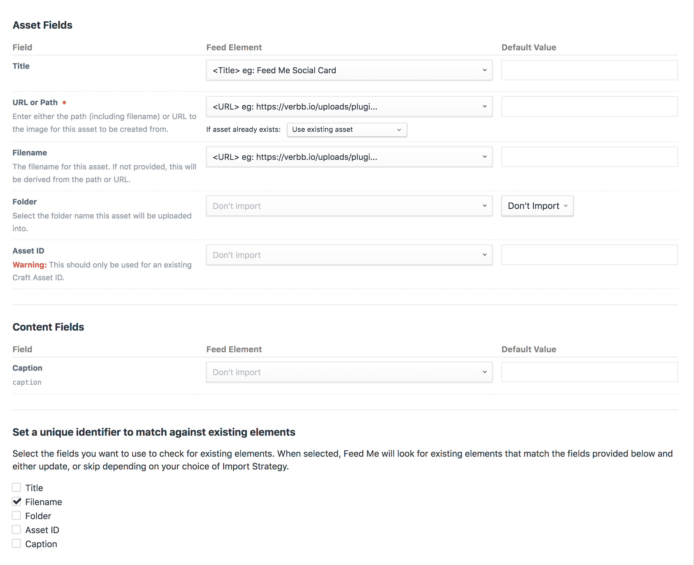
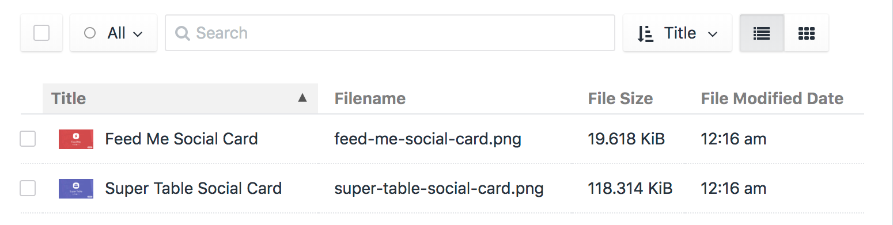

# Importing Assets 

Unlike other elements, Assets are a little bit special in how they are processed. Mostly, this is around clarity on the process of 'creating' an asset, in essense, this is uploading an image into Craft from a remote URL or local path. Both these options are supported in Feed Me.

Not only can you use Asset importing to create/upload image files, you can also use it to update them, changing things like custom fields, Title's or even filenames.

This guide will serve as a real-world example for importing a collection of remote images into Craft.

:::tip
If you've already got your image files locally, and just need them imported into Craft, there's a quicker method that doesn't involve Feed Me! First, copy the image files/folders into your volume's root folder. Then go to Utilities > Asset Indexes in your control panel. Select the volume you've just added your files to and hit "Update asset indexes".

This will scan the folder and add and images into Craft as assets.
:::

### Example Feed Data
The below data is what we'll use for this guide:

::: code
```xml
<?xml version="1.0" encoding="UTF-8"?>
<Images>
    <Image>
        <Title>Feed Me Social Card</Title>
        <URL>https://craftcms.com/uploads/plugins/feed-me/_800x455_crop_center-center_none/feed-me-social-card.png</URL>
        <Caption>Some Caption</Caption>
    </Image>

    <Image>
        <Title>Craft Commerce Social Card</Title>
        <URL>https://craftcms.com/uploads/plugins/commerce/_800x455_crop_center-center_none/commerce-social-card.png</URL>
        <Caption>Another Caption</Caption>
    </Image>
</Images>
```

```json
{
    "Image": [
        {
            "Title": "Feed Me Social Card",
            "URL": "https://craftcms.com/uploads/plugins/feed-me/_800x455_crop_center-center_none/feed-me-social-card.png",
            "Caption": "Some Caption"
        },
        {
            "Title": "Craft Commerce Social Card",
            "URL": "https://craftcms.com/uploads/plugins/commerce/_800x455_crop_center-center_none/commerce-social-card.png",
            "Caption": "Another Caption"
        }
    ]
}
```
:::

Choose either the XML or JSON (depending on your preference), and save as a file in the root of your public directory. We'll assume its `http://craft.local/assets-feed.xml`.

## Setup your Feed

With your feed data in place, go to Feed Me's main control panel screen, and add a new feed.

Enter the following details:

- **Name** - Property Feed
- **Feed URL** - `http://craft.local/assets-feed.xml`
- **Feed Type** - _XML or JSON_
- **Primary Element** - `image`
- **Element Type** - Asset
- **Asset Source** - General
- **Import Strategy** - `Create new elements`, and `Update existing elements`
- **Passkey** - Leave as generated
- **Backup** - Turn on

Click the _Save & Continue_ button to set up the primary element.

## Primary Element

The primary element can be confusing at first, but its vitally important to ensure Feed Me can hone in on the content in your feed correctly. Refer to [Primary Element →](../feature-tour/primary-element.md) for a detailed explanation.

Enter the following details:

- **Primary Element** - `/Images/Image`
- **Pagination URL** - `No Pagination URL`

Click the _Save & Continue_ button to set up the field mapping.

## Field Mapping

Use the below screenshot as a guide for the data we want to map to our asset fields. Items to note are:

- We're providing the full URL to the image to be uploaded as an asset.
- We're also telling Feed Me that if it finds an asset with the same filename to use that, rather than upload a potential duplicate.
- We're also providing the same URL as the filename. Don't worry - Feed Me will determine the filename automatically from the URL. This could optionally be your own specific filename if desired.
- We're checking against existing assets using their filename.

:::tip
The URL or Path field will only be shown if your feed setting are `Create new elements`.
:::

:::tip
While this example is for adding remote URLs, local path's work fine too. Just provide the full path, including the filename of the image you want to add. The path should be relative to the web root of your project.

For example, `to-upload/feed-me.png` would be a folder in your web root named `to-upload` with the file `feed-me.png` inside it.
:::

### Folders

This example does not require setting folders; however, if you need here is what you need to do.

- If you have a folder information in your incoming data such us `about` or `about/teams` you can set the incoming element to map to folders. 
- You can set a default folder input setting to manage any assets that don't have folder information passed forward.

:::tip
If you are including folder data and have some images that should be added to your container root you need to have their folder value set to the id of the Craft container they are importing into. So if your container ID is `1` then any file not added to a subfolder should have `1` as the folder value for those assets in the incoming feed.
:::




Click the _Save & Import_ button to begin importing your content.

## Importing your Content

Wait for the feed processing to finish. Remember, you can always navigate away from this confirmation screen.


:::tip
If you're having issues, or seeing errors at this point, look at the [Troubleshooting](../troubleshooting.md) section.
:::

You should now have 2 brand new assets in your General volume.


