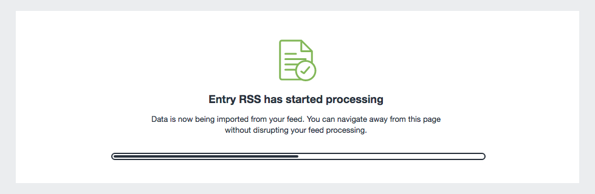
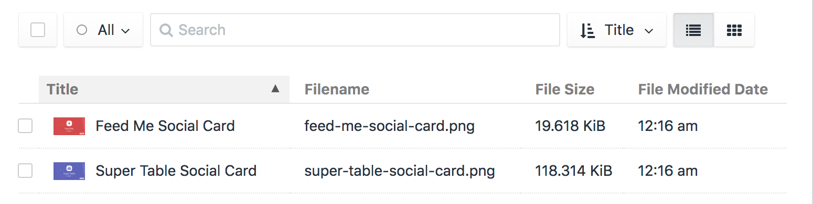

# Importing your Content

Wait for the feed processing to finish. Remember, you can always navigate away from this confirmation screen.

:::tip
If you're having issues, or seeing errors at this point, look at the [Troubleshooting](docs:support/troubleshooting) section.
:::

You should now have 2 brand new assets in your General volume.

