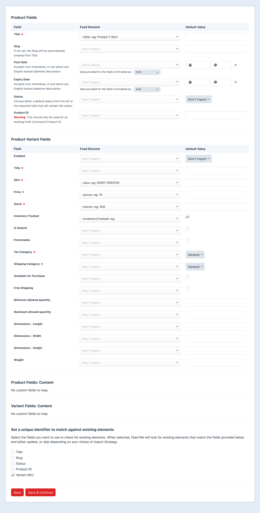
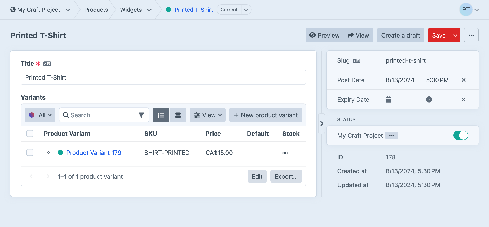
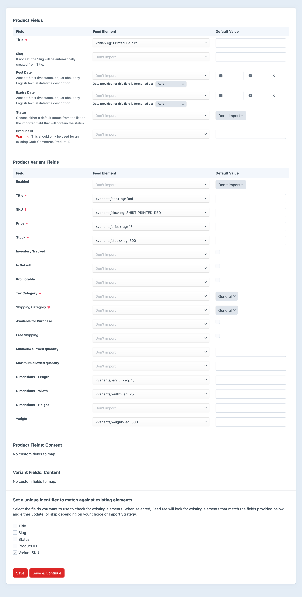

# Importing Commerce Products

In addition to Craft’s native element types, Feed Me supports importing to Craft Commerce [products and variants](https://craftcms.com/docs/commerce/5.x/system/products-variants.html).

This guide is broken down into [single-variant](#single-variant) product feeds and [multi-variant](#multiple-variants) product feeds.

::: tip
Regardless of how your feed is configured, stock is currently only imported for the first-known [inventory location](https://craftcms.com/docs/commerce/5.x/system/inventory.html#locations).
:::

## Single Variant

Feeds can provide some variant fields alongside product fields, if those products have a single variant. For example, this feed defines a `sku`, `width`, and `height` alongside the product’s `title`—despite the former being properties of variants:

### Example Feed Data

The below data is what we'll use for this guide:

```json
{
    "products": [
        {
            "title": "Printed T-Shirt",
            "sku": "SHIRT-PRINTED",
            "price": "15",
            "stock": "500",
            "length": "10",
            "width": "25",
            "height": "32",
            "weight": "500"
        },
        {
            "title": "Plain T-Shirt",
            "sku": "SHIRT-PLAIN",
            "price": "19",
            "inventoryTracked": false,
            "length": "9",
            "width": "28",
            "height": "30",
            "weight": "480"
        }
    ]
}
```

::: tip
The units for incoming `length`, `width`, `height`, and `weight` properties are assumed to be those used by the matched element’s [store](https://craftcms.com/docs/commerce/5.x/system/stores.html).
:::

### Setup your Feed

Save your import data to a file in the root of your project. We’ll assume it’s named `products.json`, for now.

With your feed data in place, go to Feed Me’s main control panel screen, and select **+ New feed**.


Enter the following details:

- **Name** — Products
- **Feed URL** — `@root/products.json`
- **Feed Type** — JSON
- **Element Type** — Commerce Product
- **Commerce Product Type** — Up to you!
- **Import Strategy** — _Create new elements_, _Update existing elements_, and (optional) _Update search indexes_
- **Passkey** — Leave as generated
- **Backup** — Turn on

Click **Save & Continue** to set up the feed’s [primary element](#primary-element).

### Primary Element

::: tip
See the [Primary Element](../feature-tour/primary-element.md) page for a detailed explanation of how to use this screen.
:::

Enter the following details:

- **Primary Element** - `/products` (Our JSON file had a top-level key named `products` that contains an array of product objects)
- **Pagination URL** - _No Pagination URL_ (All our data is in this file and we don't need to chain together multiple pages of import data)

Click the **Save & Continue** button to set up the [field mapping](#field-mapping).

### Field Mapping

Use the below screenshot as a guide for the data we want to map to our product fields.



- As these are single-variant products, we check the **Is Default** option. This tells Commerce this variant is the default variant for this product.
- Our unique identifier is the **Variant SKU**. This will work for single- and multi-variant products, because SKUs are globally unique.
- We have no custom fields for Products setup—but they would appear underneath the **Product Variant Fields** just as they do when [importing into entries](importing-entries.md), or any other element type.

Click the **Save & Continue** button to finalize the feed’s settings and proceed to the status page.

### Importing

Start an import by selecting **Process it now** on the status screen, or returning to the main Feed Me screen and selecting **Run feed**.

:::tip
If you're having issues, or seeing errors at this point, look at the [Troubleshooting](../troubleshooting.md) section.
:::

You should now have two new products in your selected product type:



## Multiple Variants

The setup process for multi-variant feeds mostly overlaps with how we configured a single-variant feed. Your incoming data must be structured up in such a way that each variant’s content is isolated.

### Example Data

Note that each product in our feed now has a `variants` key, and all the variant-specific properties have been moved into objects nested therein:

```json{7,36}
{
    "products": [
        {
            "title": "Printed T-Shirt",
            "featuredImage": "t-shirt-printed.jpg",
            "description": "The best T-Shirt you'll ever wear",
            "variants": [
                {
                    "title": "Red",
                    "sku": "SHIRT-PRINTED-RED",
                    "price": "15",
                    "stock": "500",
                    "length": "10",
                    "width": "25",
                    "height": "32",
                    "weight": "500",
                    "images": ["t-shirt-printed-red.jpg"]
                },
                {
                    "title": "Blue",
                    "sku": "SHIRT-PRINTED-BLUE",
                    "price": "15",
                    "stock": "1000",
                    "length": "10",
                    "width": "25",
                    "height": "32",
                    "weight": "500",
                    "images": ["t-shirt-printed-blue.jpg"]
                }
            ]
        },
        {
            "title": "Plain T-Shirt",
            "featuredImage": "t-shirt-plain.jpg",
            "description": "The second-best T-Shirt you'll ever wear",
            "variants": [
                {
                    "title": "Green",
                    "sku": "SHIRT-PLAIN-GREEN",
                    "price": "15",
                    "stock": "500",
                    "length": "10",
                    "width": "25",
                    "height": "32",
                    "weight": "500",
                    "images": ["t-shirt-plain-green.jpg"]
                },
                {
                    "title": "Purple",
                    "sku": "SHIRT-PLAIN-PURPLE",
                    "price": "15",
                    "stock": "1000",
                    "length": "10",
                    "width": "25",
                    "height": "32",
                    "weight": "500",
                    "images": ["t-shirt-plain-purple.jpg"]
                }
            ]
        }
    ]
}
```

Let’s assume this file exists alongside `products.json` and is named `products-multivariant.json`.

### Field Mapping

In the **Field Mapping** step, some adjustments are required. Note that fields assigned to variants now have a `/` in their “path,” indicating they are present in the nested `variants` array on each product. Feed Me knows that these properties and fields are mapped to nested elements, and will apply them to each variant present in the data:



::: tip
Matching elements based on SKU will work for both the product _and_ variant! Feed Me can infer what product to update based on the SKU(s) of nested variants.
:::
