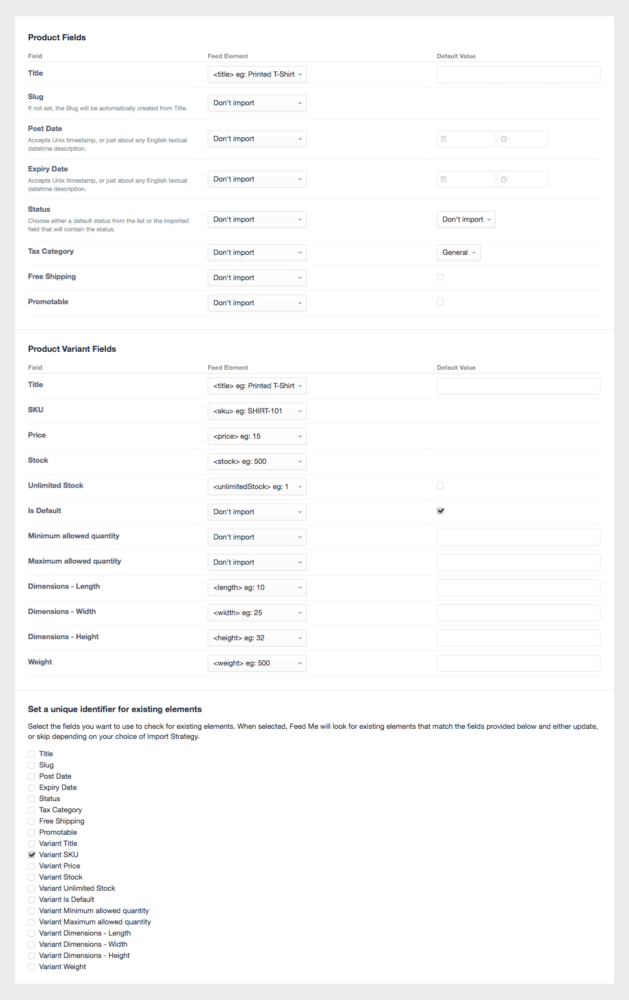

# Field Mapping

Use the below screenshot as a guide for the data we want to map to our product fields.

#### Things to note

- As these are single variant products, we check the `Is Default` option. This tells Commerce this variant is the default variant for this product.
- Our unique identifier is the Variant SKU - simply as its unique to each product.
- We have no custom fields for Products setup - but they would appear underneath the Product Variant Fields as per a regular [Importing into Entries](docs:guides/importing-entries) workflow.

* * *

Click the _Save & Import_ button to start [Importing your Content →](docs:guides/importing-commerce-products/field-mapping)
