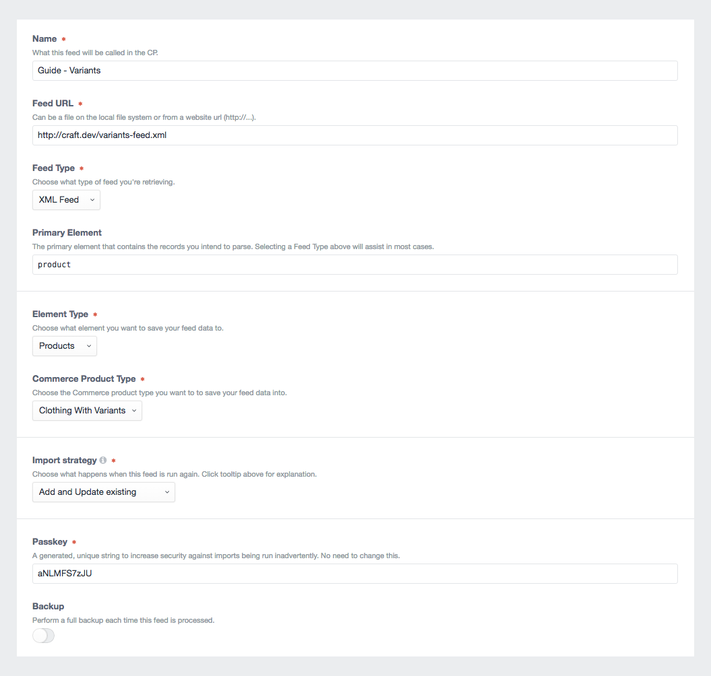
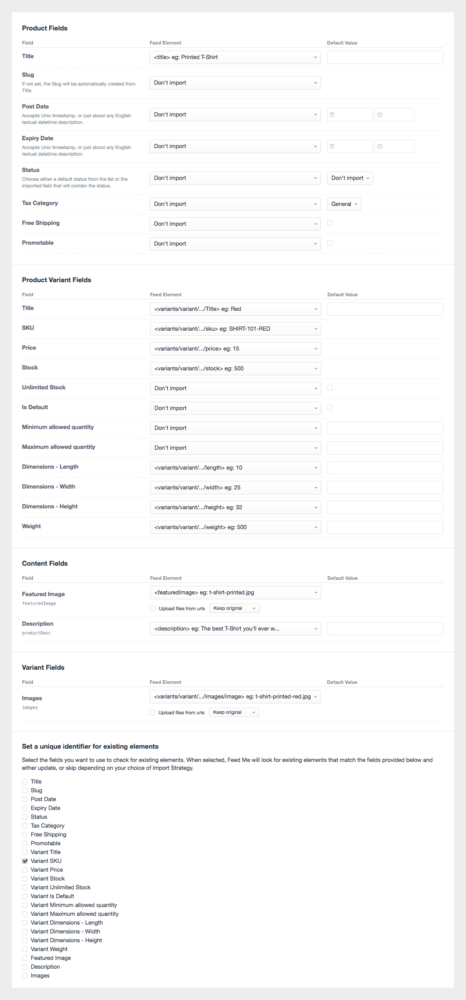
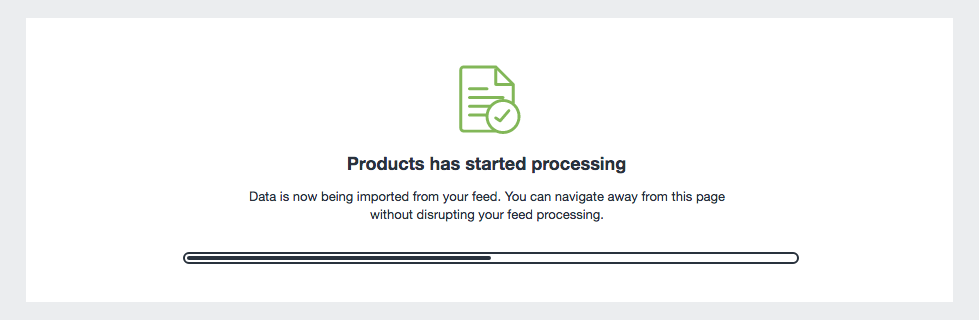
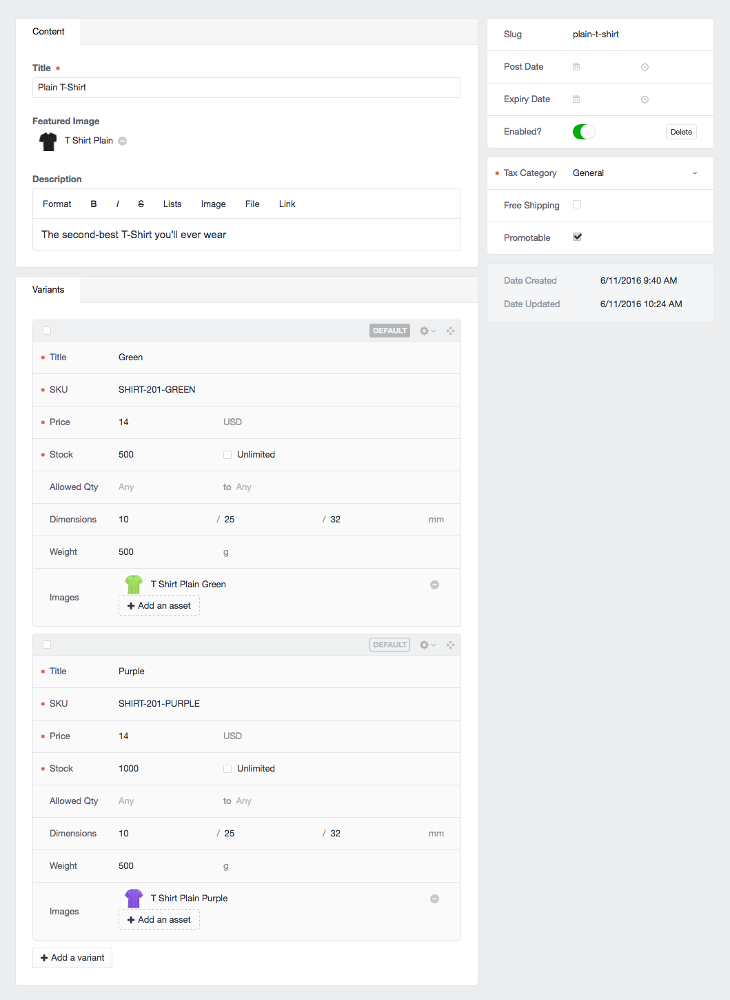
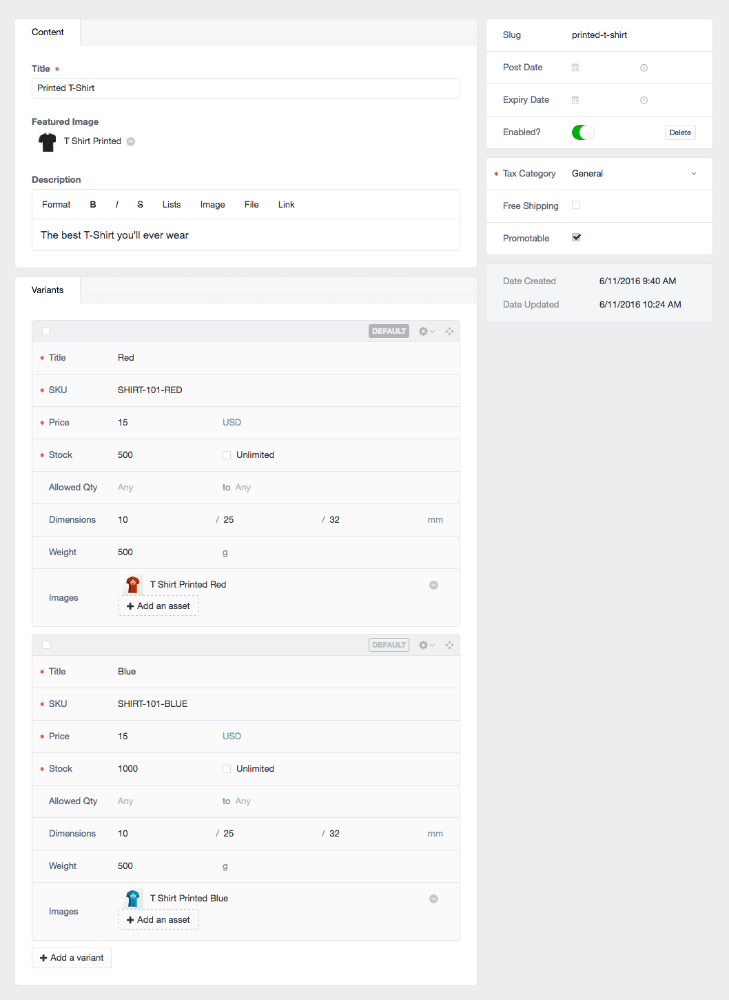

# Importing Commerce Variants

This guide will serve as a real-world example of importing Commerce Products into [Craft Commerce](http://craftcommerce.com). We'll be importing two T-Shirt products into Commerce, each with their own set of variants. This guide specifically deals with **multiple-variant** products.

:::tip
Looking to import products without Variants? Have a look at the [Importing Commerce Products](importing-commerce-products.md) guide.
:::

### Example Feed Data

The below data is what we'll use for this guide:

::: code-group
```xml
<?xml version="1.0" encoding="UTF-8"?>
<products>
    <product>
        <title>Printed T-Shirt</title>
        <featuredImage>t-shirt-printed.jpg</featuredImage>
        <description>The best T-Shirt you'll ever wear</description>

        <variants>
            <variant>
                <Title>Red</Title>
                <sku>SHIRT-101-RED</sku>
                <price>15</price>
                <stock>500</stock>
                <length>10</length>
                <width>25</width>
                <height>32</height>
                <weight>500</weight>

                <images>
                    <image>t-shirt-printed-red.jpg</image>
                </images>
            </variant>

            <variant>
                <Title>Blue</Title>
                <sku>SHIRT-101-BLUE</sku>
                <price>15</price>
                <stock>1000</stock>
                <length>10</length>
                <width>25</width>
                <height>32</height>
                <weight>500</weight>
                
                <images>
                    <image>t-shirt-printed-blue.jpg</image>
                </images>
            </variant>
        </variants>
    </product>

    <product>
        <title>Plain T-Shirt</title>
        <featuredImage>t-shirt-plain.jpg</featuredImage>
        <description>The second-best T-Shirt you'll ever wear</description>

        <variants>
            <variant>
                <Title>Green</Title>
                <sku>SHIRT-201-GREEN</sku>
                <price>15</price>
                <stock>500</stock>
                <length>10</length>
                <width>25</width>
                <height>32</height>
                <weight>500</weight>
                
                <images>
                    <image>t-shirt-plain-green.jpg</image>
                </images>
            </variant>

            <variant>
                <Title>Purple</Title>
                <sku>SHIRT-201-PURPLE</sku>
                <price>15</price>
                <stock>1000</stock>
                <length>10</length>
                <width>25</width>
                <height>32</height>
                <weight>500</weight>
                
                <images>
                    <image>t-shirt-plain-purple.jpg</image>
                </images>
            </variant>
        </variants>
    </product>
</products>
```

```json
{
    "product": [
        {
            "title": "Printed T-Shirt",
            "featuredImage": "t-shirt-printed.jpg",
            "description": "The best T-Shirt you'll ever wear",
            "variants": {
                "variant": [
                    {
                        "Title": "Red",
                        "sku": "SHIRT-101-RED",
                        "price": "15",
                        "stock": "500",
                        "length": "10",
                        "width": "25",
                        "height": "32",
                        "weight": "500",
                        "images": {
                            "image": "t-shirt-printed-red.jpg"
                        }
                    },
                    {
                        "Title": "Blue",
                        "sku": "SHIRT-101-BLUE",
                        "price": "15",
                        "stock": "1000",
                        "length": "10",
                        "width": "25",
                        "height": "32",
                        "weight": "500",
                        "images": {
                            "image": "t-shirt-printed-blue.jpg"
                        }
                    }
                ]
            }
        },
        {
            "title": "Plain T-Shirt",
            "featuredImage": "t-shirt-plain.jpg",
            "description": "The second-best T-Shirt you'll ever wear",
            "variants": {
                "variant": [
                    {
                        "Title": "Green",
                        "sku": "SHIRT-201-GREEN",
                        "price": "15",
                        "stock": "500",
                        "length": "10",
                        "width": "25",
                        "height": "32",
                        "weight": "500",
                        "images": {
                            "image": "t-shirt-plain-green.jpg"
                        }
                    },
                    {
                        "Title": "Purple",
                        "sku": "SHIRT-201-PURPLE",
                        "price": "15",
                        "stock": "1000",
                        "length": "10",
                        "width": "25",
                        "height": "32",
                        "weight": "500",
                        "images": {
                            "image": "t-shirt-plain-purple.jpg"
                        }
                    }
                ]
            }
        }
    ]
}
```
:::

#### Things to note

- We've got multiple products, and multiple variants. Product information should be stored under each variant.
- `sku` is compulsory for each variant
- `length`, `width`, `height` and `weight` should all be units according to your Commerce settings
- We have a `title` for the product, and `title`'s for each variant

Choose either the XML or JSON (depending on your preference), and save as a file in the root of your public directory. We'll assume its `http://craft.local/variants-feed.xml`.

## Setup your Feed

With your feed data in place, go to Feed Me's main control panel screen, and add a new feed.



Enter the following details:

- **Name** - Products
- **Feed URL** - `http://craft.local/variants-feed.xml`
- **Feed Type** - _XML or JSON_
- **Element Type** - Products
- **Commerce Product Type** - Clothing (or similar)
- **Import Strategy** - `Create new elements`, and `Update existing elements`
- **Passkey** - Leave as generated
- **Backup** - Turn on

Click the _Save & Continue_ button to set up the primary element.

## Primary Element

The primary element can be confusing at first, but its vitally important to ensure Feed Me can hone in on the content in your feed correctly. Refer to [Primary Element →](../feature-tour/primary-element.md) for a detailed explanation.

Enter the following details:

- **Primary Element** - `/products/product`
- **Pagination URL** - `No Pagination URL`

Click the _Save & Continue_ button to set up the field mapping.

## Field Mapping

Use the below screenshot as a guide for the data we want to map to our product fields.



#### Things to note

- Our unique identifier is the Variant SKU - simply as its unique to each product.
- We have some custom fields for Products and Variants mapped.

* * *

Click the _Save & Import_ button to begin importing your content.

## Importing your Content

Wait for the feed processing to finish. Remember, you can always navigate away from this confirmation screen.



:::tip
If you're having issues, or seeing errors at this point, look at the [Troubleshooting](../troubleshooting.md) section.
:::

You should now have 2 brand new products in your Clothing product type.




