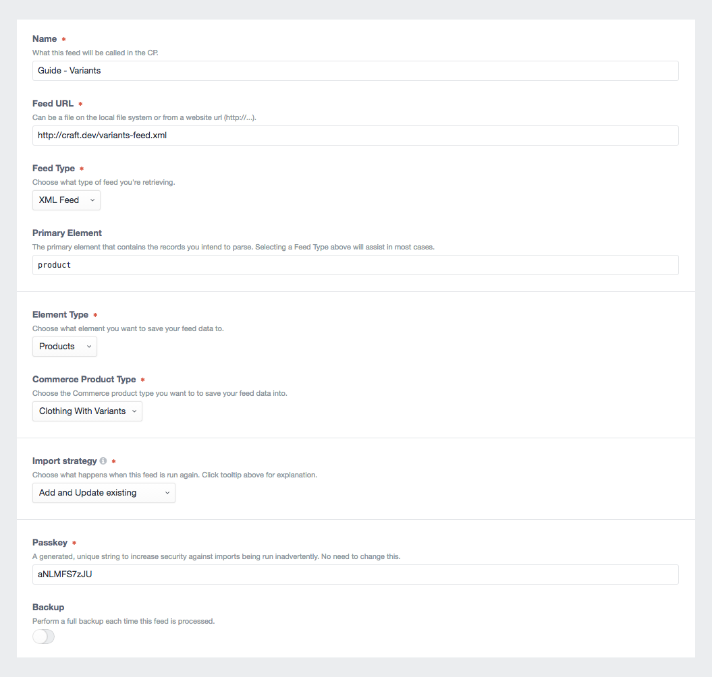

# Setup your Feed

With your feed data in place, go to Feed Me's main control panel screen, and add a new feed.

Enter the following details:

- **Name** - Products
- **Feed URL** - `http://craft.local/variants-feed.xml`
- **Feed Type** - _XML or JSON_
- **Element Type** - Products
- **Commerce Product Type** - Clothing (or similar)
- **Import Strategy** - `Create new elements`, and `Update existing elements`
- **Passkey** - Leave as generated
- **Backup** - Turn on

* * *

Click the _Save & Continue_ button to proceed to [Primary Element →](docs:guides/importing-commerce-variants/primary-element)
