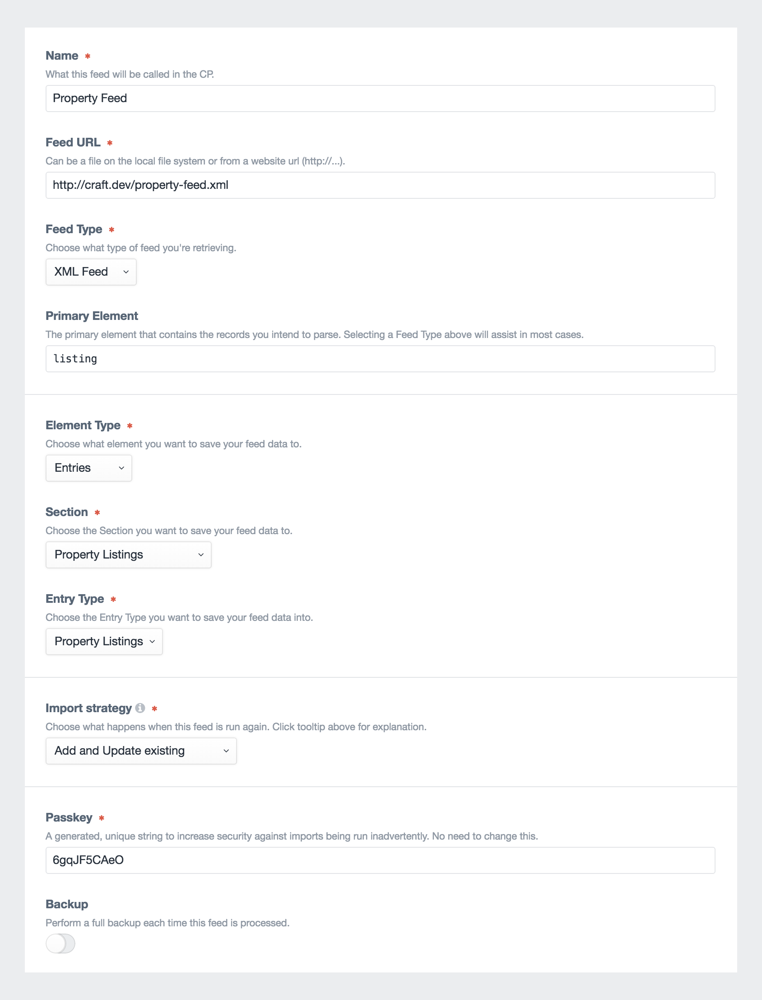
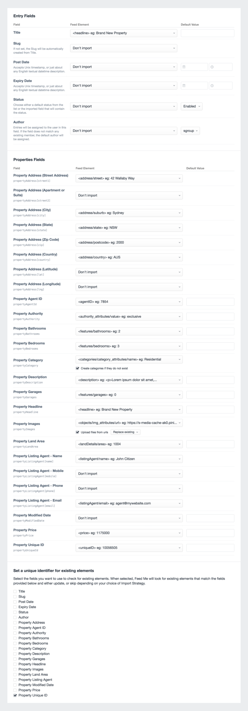
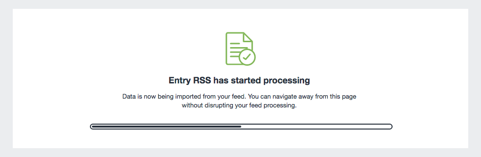
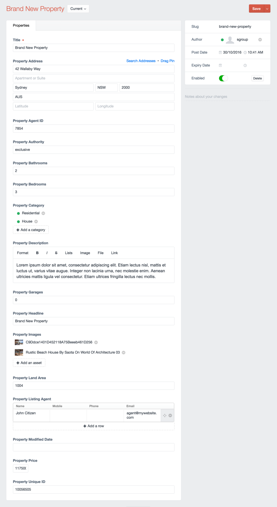

# Importing Entries

Importing Entries is one of the more common tasks for Feed Me, but this same guide applies for any other Element Type you wish to import. This guide will serve as a real-world example for importing real estate property listings.

:::tip
Looking for a Matrix example? Check out [Import into Matrix](importing-into-matrix.md).
:::

### Example Feed Data
The below data is what we'll use for this guide:

::: code-group
```xml
<?xml version="1.0" encoding="UTF-8"?>
<propertyList>
    <listing>
        <agentID>7854</agentID>
        <uniqueID>10056505</uniqueID>
        <authority value="exclusive" />
        <underOffer value="no" />
        <newConstruction>1</newConstruction>
        <price display="yes">1175000</price>

        <listingAgent id="1">
            <name>John Citizen</name>
            <email>agent@mywebsite.com</email>
        </listingAgent>

        <address display="no">
            <street>42 Wallaby Way</street>
            <suburb display="no">Sydney</suburb>
            <state>NSW</state>
            <postcode>2000</postcode>
            <country>AUS</country>
        </address>

        <categories>
            <category>Residential</category>
            <category>House</category>
        </categories>

        <headline>Brand New Property</headline>

        <description><![CDATA[<p>Lorem ipsum dolor sit amet, consectetur adipiscing elit. Etiam lectus nisl, mattis et luctus ut, varius vitae augue. Integer non lacinia urna, nec molestie enim. Aenean ultricies mattis ligula vel consectetur. Etiam ultrices fringilla lectus nec mollis.</p>]]></description>

        <features>
            <bedrooms>3</bedrooms>
            <bathrooms>2</bathrooms>
            <garages>0</garages>
        </features>

        <landDetails>
            <area unit="squareMeter">1004</area>
        </landDetails>

        <objects>
            
            
        </objects>
    </listing>

    <listing>
        <agentID>7854</agentID>
        <uniqueID>10056506</uniqueID>
        <price display="yes">500000</price>

        <listingAgent id="1">
            <name>John Citizen</name>
            <email>agent@mywebsite.com</email>
        </listingAgent>

        <address display="no">
            <street>43 Wallaby Way</street>
            <suburb display="no">Sydney</suburb>
            <state>NSW</state>
            <postcode>2000</postcode>
            <country>AUS</country>
        </address>

        <categories>
            <category>Commercial</category>
        </categories>

        <headline>Another New Property</headline>

        <description><![CDATA[<p>Lorem ipsum dolor sit amet, consectetur adipiscing elit. Etiam lectus nisl, mattis et luctus ut, varius vitae augue. Integer non lacinia urna, nec molestie enim. Aenean ultricies mattis ligula vel consectetur. Etiam ultrices fringilla lectus nec mollis.</p>]]></description>

        <features>
            <bedrooms>3</bedrooms>
            <bathrooms>2</bathrooms>
            <garages>0</garages>
        </features>

        <landDetails>
            <area unit="squareMeter">2004</area>
        </landDetails>

        <objects>
            
        </objects>
    </listing>
</propertyList>
```

```json
{
    "listing": [
        {
            "agentID": "7854",
            "uniqueID": "10056505",
            "authority": {
                "@attributes": {
                    "value": "exclusive"
                }
            },
            "underOffer": {
                "@attributes": {
                    "value": "no"
                }
            },
            "newConstruction": "1",
            "price": "1175000",
            "listingAgent": {
                "@attributes": {
                    "id": "1"
                },
                "name": "John Citizen",
                "email": "agent@mywebsite.com"
            },
            "address": {
                "@attributes": {
                    "display": "no"
                },
                "street": "42 Wallaby Way",
                "suburb": "Sydney",
                "state": "NSW",
                "postcode": "2000",
                "country": "AUS"
            },
            "categories": {
                "category": [
                    "Residential",
                    "House"
                ]
            },
            "headline": "Brand New Property",
            "description": {},
            "features": {
                "bedrooms": "3",
                "bathrooms": "2",
                "garages": "0"
            },
            "landDetails": {
                "area": "1004"
            },
            "objects": {
                "img": [
                    {
                        "@attributes": {
                            "id": "m",
                            "modTime": "2016-08-05-00:35:44",
                            "format": "jpg",
                            "url": "https://s-media-cache-ak0.pinimg.com/originals/c9/dd/ce/c9ddce1401d452118a75beeeb461d256.jpg"
                        }
                    },
                    {
                        "@attributes": {
                            "id": "a",
                            "modTime": "2016-08-05-00:35:44",
                            "format": "jpg",
                            "url": "http://1.bp.blogspot.com/-6lmtHQFj5ZU/U-vLS9J9QrI/AAAAAAAAfxY/WRMOT1Fbv5I/s1600/Rustic_Beach_House_by_SAOTA_on_world_of_architecture_03.jpg"
                        }
                    }
                ]
            }
        },
        {
            "agentID": "7854",
            "uniqueID": "10056506",
            "price": "500000",
            "listingAgent": {
                "@attributes": {
                    "id": "1"
                },
                "name": "John Citizen",
                "email": "agent@mywebsite.com"
            },
            "address": {
                "@attributes": {
                    "display": "no"
                },
                "street": "43 Wallaby Way",
                "suburb": "Sydney",
                "state": "NSW",
                "postcode": "2000",
                "country": "AUS"
            },
            "categories": {
                "category": "Commercial"
            },
            "headline": "Another New Property",
            "description": {},
            "features": {
                "bedrooms": "3",
                "bathrooms": "2",
                "garages": "0"
            },
            "landDetails": {
                "area": "2004"
            },
            "objects": {
                "img": {
                    "@attributes": {
                        "id": "m",
                        "modTime": "2016-08-05-00:35:44",
                        "format": "jpg",
                        "url": "https://s-media-cache-ak0.pinimg.com/originals/c9/dd/ce/c9ddce1401d452118a75beeeb461d256.jpg"
                    }
                }
            }
        }
    ]
}
```
:::

Choose either the XML or JSON (depending on your preference), and save as a file in the root of your public directory. We'll assume its `http://craft.local/property-feed.xml`.

## Setup your Feed

With your feed data in place, go to Feed Me's main control panel screen, and add a new feed.



Enter the following details:

- **Name** - Property Feed
- **Feed URL** - `http://craft.local/property-feed.xml`
- **Feed Type** - _XML or JSON_
- **Primary Element** - `listing`
- **Element Type** - Entries
- **Section** - Property Listings
- **Entry Type** - Property Listings
- **Import Strategy** - `Create new elements`, and `Update existing elements`
- **Passkey** - Leave as generated
- **Backup** - Turn on

Click the _Save & Continue_ button to set up the primary element.

## Primary Element

The primary element can be confusing at first, but its vitally important to ensure Feed Me can hone in on the content in your feed correctly. Refer to [Primary Element →](../feature-tour/primary-element.md) for a detailed explanation.

Enter the following details:

- **Primary Element** - `/propertyList/listing`
- **Pagination URL** - `No Pagination URL`

Click the _Save & Continue_ button to set up the field mapping.

## Field Mapping

Use the below screenshot as a guide for the data we want to map to our entry fields. Items to note are:

- We're creating Property Categories if they don't already exist
- We're uploading the remote URLs in the feed for Property Images. These will be uploaded to Craft's assets.
- We're checking against existing entries and their Property Unique ID value. In this case, Title isn't necessarily unique enough.



Click the _Save & Import_ button to begin importing your content.

## Importing your Content

Wait for the feed processing to finish. Remember, you can always navigate away from this confirmation screen.



:::tip
If you're having issues, or seeing errors at this point, look at the [Troubleshooting](../troubleshooting.md) section.
:::

You should now have 2 brand new entries in your Property Listings section.


