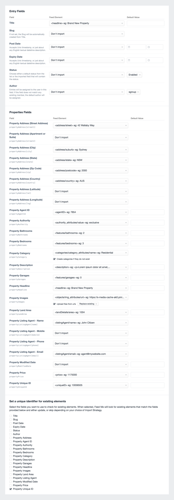

# Field Mapping

Use the below screenshot as a guide for the data we want to map to our entry fields. Items to note are:

- We're creating Property Categories if they don't already exist
- We're uploading the remote URLs in the feed for Property Images. These will be uploaded to Craft's assets.
- We're checking against existing entries and their Property Unique ID value. In this case, Title isn't necessarily unique enough.

* * *

Click the _Save & Import_ button to start [Importing your Content →](docs:guides/importing-entries/importing-your-content)
