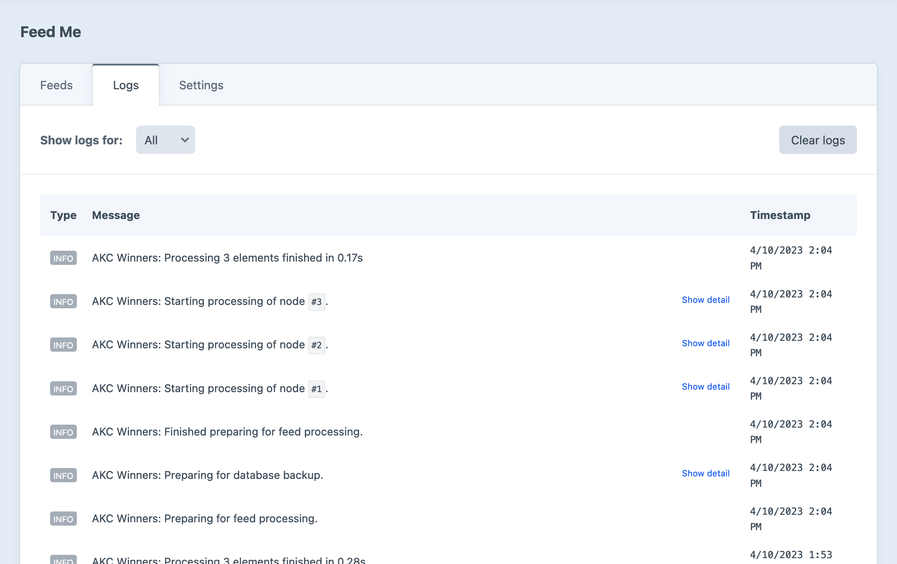

# Troubleshooting Tips

### Performance

If you're experiencing slow processing for your feed, try the following:

- Turn off `devMode`. Craft's built-in logging when devMode is switched on can greatly slow down the import process, and cause a high degree of memory overhead.
- Similarly, when importing, make sure to disable the debug toolbar under your user account preferences. It can cause high memory overhead and other resource related issues.
- Consider turning on the `compareContent` [configuration setting](get-started/configuration.md#configuration-options) to prevent unnecessary content overwriting.
- Consider selecting the **Add Entries** option for duplication handling, depending on your requirements.
- Consider turning off feeds’ **Backup** option, on large sites (if you have other rollback options).
- Check if your feed is available as JSON. PHP can parse JSON much faster than XML documents.

You may also need to adjust the `memory_limit` and `max_execution_time` values in your php.ini file if you run into memory issues.

### Unexpected Results

If you're getting unexpected results when running an import, try to isolate the issue by selectively mapping fields until you have a bare-minimum import. For example, if you're mapping 20+ fields for an entry import, try to map just the **Title** field, and work your way through mapping additional fields until things stop working.

### Logging

Feed Me records verbose logs as it reads feed data, matches elements, and applies changes. If you're experiencing issues or getting unexpected results with a Feed, consult the **Logs** tab first.

::: tip
For some steps, log messages are stored hierarchically, and collapses groups of messages. Expand a group using the **Show detail** action at the right edge of a message.
:::

### Debugging

Feed Me includes a special view to assist with debugging your feed, should you encounter issues or errors during an import. With [devMode](https://craftcms.com/docs/config-settings#devMode) enabled, click the “gear” in the problematic feed’s row to expand its utility drawer, then click **Debug**.

Debug output will be a combination of [`print_r`](https://www.php.net/manual/en/function.print-r.php)-formatted objects and log messages, providing you with as much information as possible about your feed settings, field-mappings, and data. If exceptions occur while processing the feed, they’ll appear on this page, too.

::: warning
Debugging a feed attempts to actually run the import, so make sure you have [backups](./feature-tour/creating-your-feed#backup) on, or are working in a disposable environment!
:::
