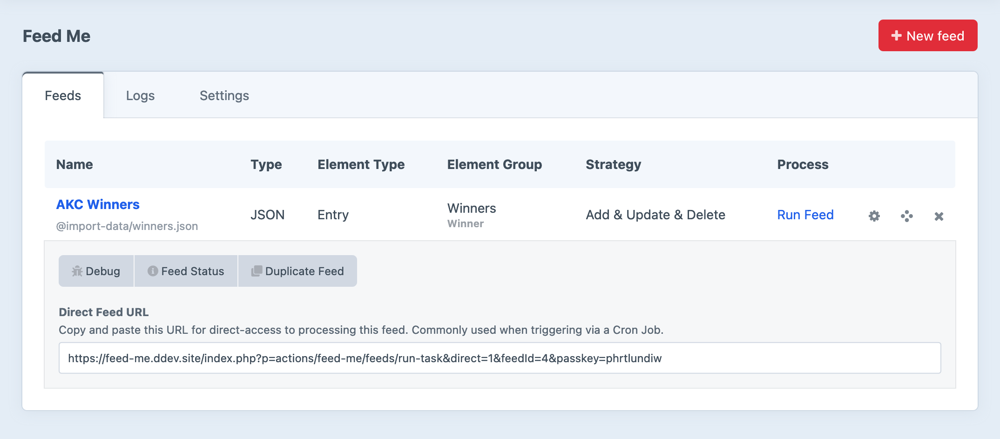

# Troubleshooting Tips

### Performance

If you're experiencing slow processing for your feed, try the following:

- Turn off `devMode`. Craft's built-in logging when devMode is switched on will greatly slow down the import process, and causes a high degree of memory overhead.
- Consider turning on the `checkExistingFieldData` [configuration setting](docs:get-started/configuration#configuration-options) to prevent unnecessary content overwriting.
- Consider selecting the Add Entries option for duplication handling, depending on your requirements.
- Consider turning off the Backup option for the feed. This will depend on your specific circumstances.
- Opt for a JSON feed - there is significantly less processing overhead as opposed to XML.

You may also need to adjust the `memory_limit` and `max_execution_time` values in your php.ini file if you run into memory issues.

### Unexpected Results

If you're experiencing unexpected results when running an import, try to isolate the issue by selectively mapping fields until you have a bare-minimum import.

For example, if you're mapping 20+ fields for an Entry import, but it isn't working, try to map just the Title field, and work your way through mapping additional fields until things stop working as expected.

### Logging

Feed Me create a log event for just about everything it does, notably errors, but other useful information. If you're experiencing issues or unexpected results with a Feed, consult the Logs tab first.

### Debugging

There is a special controller action to assist with debugging your feed, should you encounter issues, or errors during an import. The easiest way to get to this is clicking on the small 'bug' icon on the feeds index page (image below). The icon is placed in the Actions column on the far right, but only visible when [devMode](https://craftcms.com/docs/config-settings#devMode) is turned on.

The output from this page will be in raw format, providing you with as much information as possible about your feed settings, field-mappings and data. If there are code exceptions, they'll appear on this page.
